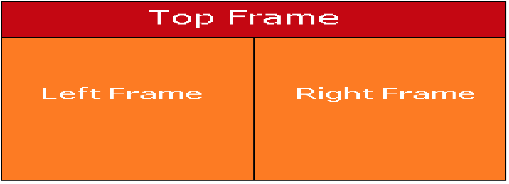
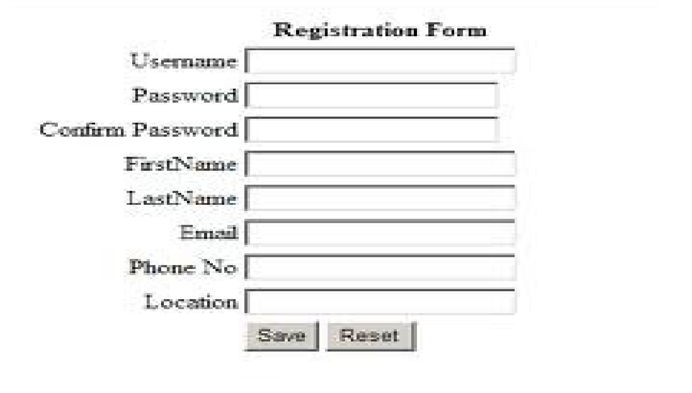

# Day 3

## Do the revision from [Day 1](./day-1.md) and [Day 2](./day-2.md)

## HTML
- [Links](https://www.w3schools.com/html/html_links.asp)
- [Images](https://www.w3schools.com/html/html_images.asp)

## CSS
- [Height/Width](https://www.w3schools.com/css/css_dimension.asp)
- [Box Model](https://www.w3schools.com/css/css_boxmodel.asp)
- [Outline](https://www.w3schools.com/css/css_outline.asp)

## Javascript
- [Operators](https://www.w3schools.com/js/js_operators.asp)

## Practical Exams 

### Question 1 - Write the HTML code to generate following output

### Question 2 - Write the HTML code to generate following output

- Registration Form header should be h1
  - Form Text Should be on center
- Form labels and the text boxes should be aligned properly
- `Save` button will output the form details with
  - console.log
  - window.Alert
  - Document.write after the Save and Reset buttons
- `Reset` button will clear all the form values 

